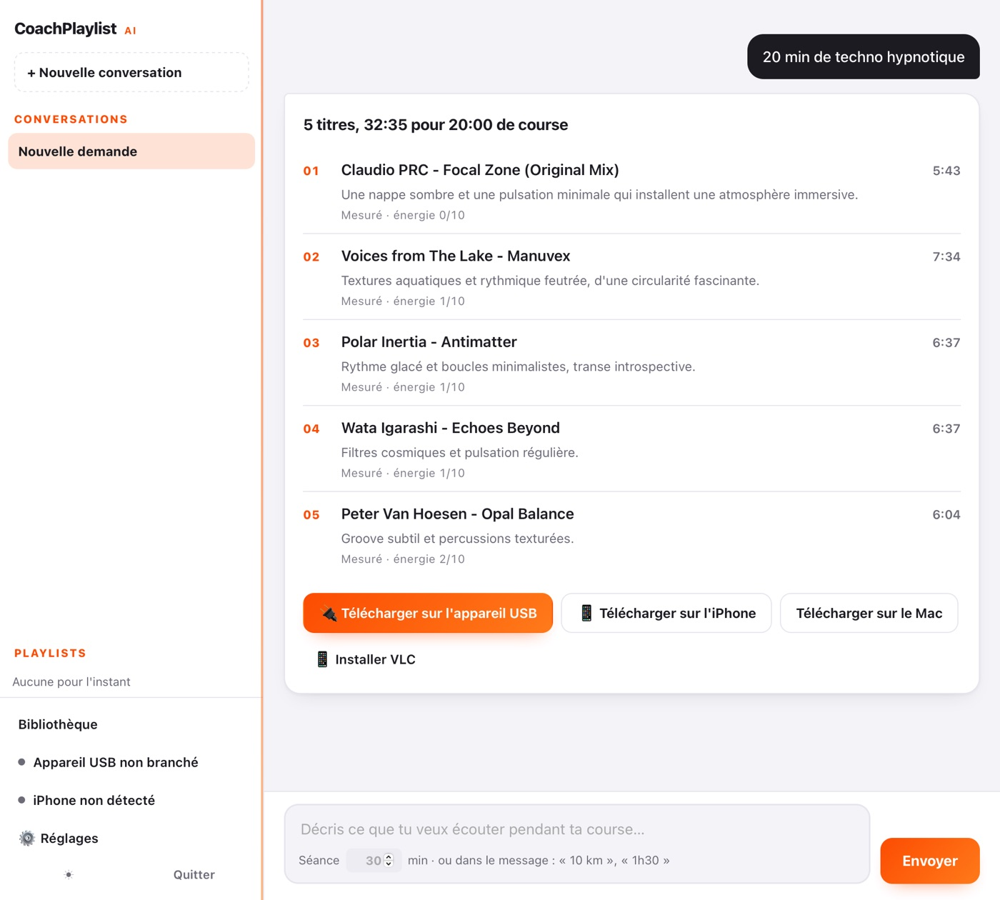
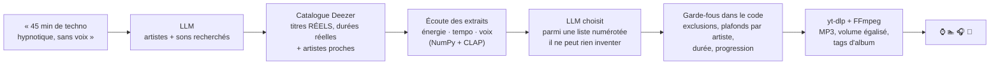
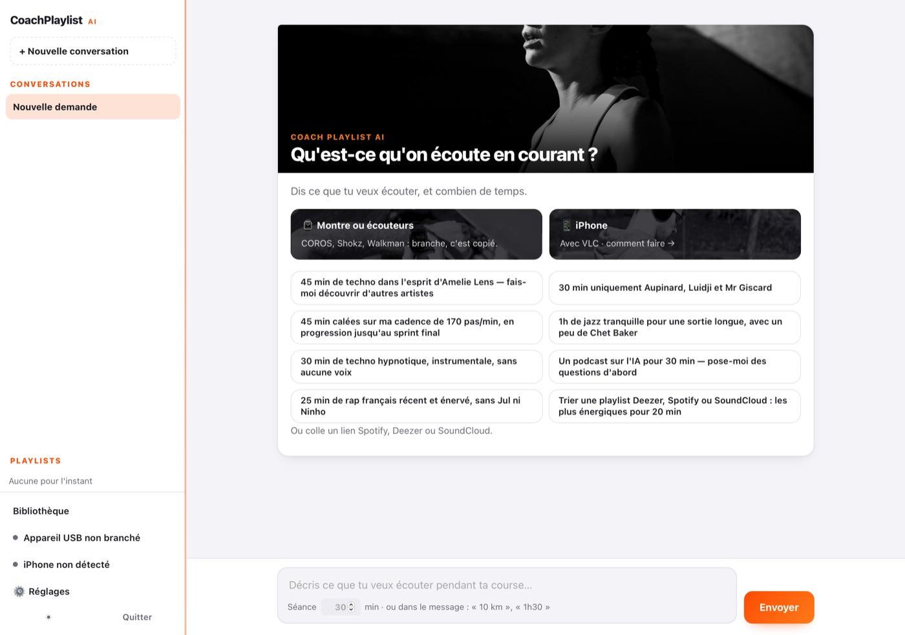

<p align="center">
  
</p>

<p align="center">
  <b>Une app macOS qui transforme une phrase en playlist de course :<br>
  elle choisit des titres réels, les écoute, les télécharge et les envoie sur une montre, des écouteurs ou un iPhone.</b>
</p>

<p align="center">
  
  
  
  
  
  
</p>

> **Vitrine du projet.** Le code de l'application est dans un dépôt privé, accessible sur demande.
> L'app est utilisée par un petit cercle d'amis coureurs : [coachplaylist.vercel.app](https://coachplaylist.vercel.app).

<details>
<summary><b>In English</b></summary>

CoachPlaylistAI turns one sentence (“45 min at 170 steps/min, building up to a final sprint”) into an offline running playlist. A general-purpose LLM (Gemini or ChatGPT) is made domain-specific **without any training**: it only names artists, a real catalogue (Deezer) supplies the tracks, every candidate is **listened to** (NumPy signal features + LAION-CLAP zero-shot audio), and hard constraints (duration, exclusions, per-artist caps, energy progression) are enforced in code. Measured: unfound suggestions 11 % → 2.4 %, curation 86 s → 34 s, vocal detection on 65 of 66 original/instrumental pairs. Ships as a native macOS app (Swift + local Python server) with one-line install, USB sync to COROS watches / Shokz / Walkman and iPhone delivery through VLC.
</details>

---

```
« 45 min calées sur ma cadence de 170 pas/min, en progression jusqu'au sprint final »
```

→ 13 titres de drum & bass entre **172 et 174 BPM mesurés**, énergie qui monte de 4/10 à 10/10, tagués comme un album, copiés sur la montre.

<p align="center">
  
</p>

## Le problème

Courir avec sa musique sans téléphone, c'est charger des MP3 sur une montre (COROS) ou des écouteurs (Shokz OpenSwim) à la main, en USB, et composer soi-même une playlist qui dure le bon temps. Les générateurs de playlists par IA existent (Deezer, Spotify), mais aucun ne **cale une playlist sur une durée**, ne **livre des fichiers hors ligne**, ni n'**explique ses choix**.

## Un LLM généraliste, rendu spécialiste

Aucun modèle n'a été entraîné. Un LLM généraliste a une bonne culture musicale mais trois défauts pour ce travail : il **invente** des titres, il ne **connaît pas le son** des morceaux, et il **compte mal** les minutes. Le projet l'entoure de briques qui compensent chacun de ces défauts.



| Le défaut du LLM | Ce qui le corrige | Mesuré |
|---|---|---|
| Il invente des titres | **Retrieval d'abord** : il ne nomme que des artistes, le catalogue fournit les titres ; il choisit ensuite des **numéros** dans une liste réelle | propositions introuvables **11 % → 2,4 %**, curation **86 s → 34 s** |
| Il ne connaît pas le son | **Descripteurs audio** calculés sur l'extrait de 30 s (NumPy) et **écoute zéro-exemple** avec CLAP | énergie : AUC 0,98 tous genres ; voix détectée sur **65 paires sur 66** (original / instrumental) |
| Il compte mal | La durée réelle de chaque titre fait foi ; il reçoit un **nombre** de titres, le code complète ou retire | tempo juste à l'octave près sur **26/26** titres de référence |
| Il dérive | **Rôles des artistes** lus dans la demande (exclusif, référence, dose, exclu) et appliqués dans le code, pas dans le prompt | « uniquement », « sans », « un peu de » respectés sur toutes les demandes de l'A/B |

L'architecture s'inspire de **Text2Playlist** de Deezer ([ECIR 2025, arXiv:2501.05894](https://arxiv.org/abs/2501.05894)) : *le LLM ne génère jamais un nom de morceau*.

## Ce que le projet montre

- **Mesurer avant d'intégrer.** Chaque amélioration (graphe d'artistes, descripteurs audio, CLAP, reclassement, second modèle) est passée par un **A/B sur des demandes réelles**, avec des vérités de terrain **indépendantes** — playlists éditoriales Deezer, BPM du catalogue, paires original/instrumental, tags MusicBrainz. Plusieurs pistes séduisantes ont été **rejetées** sur ces mesures : un indicateur d'« attaques par seconde » s'est révélé quasi aléatoire (AUC 0,60 tous genres, 0,52 dans le rap), une durée « officielle » MusicBrainz coûtait plus de bons titres qu'elle n'en sauvait.
- **Lire les résultats, pas seulement les chiffres.** Un taux de rejet bas peut cacher un filtre qui laisse tout passer : plusieurs défauts n'ont été trouvés qu'en lisant les titres retenus (featurings qui cassaient « chanteuses brésiliennes », doublons qui gonflaient un album, rap mal classé « instrumental »).
- **Des garde-fous dans le code, pas dans le prompt.** Exclusions, plafonds par artiste, progression d'énergie, durée minimale : tout ce qui doit être garanti est appliqué après le modèle.
- **Sécurité d'une app qui exécute du contenu tiers.** Revue complète avant publication : une URL de podcast piégée pouvait être lue comme une option de yt-dlp — corrigée et figée par un test. Le modèle ChatGPT tourne **sans aucun outil**, car les titres venus de l'extérieur pourraient contenir des instructions (vérifié avec un fichier témoin).
- **Livrer à de vrais utilisateurs non techniques.** App macOS native, installation en une commande sans réglage de sécurité, notification de mise à jour, diagnostic à distance par journal — et des bugs qui n'existaient que chez les autres (Mac Intel sans OpenSSL, fenêtre qui avale les dialogues, fichiers cachés macOS sur les montres).

| | |
|---|---|
| Python | ~11 200 lignes, 28 modules |
| Interface | page web locale sans dépendance (~2 200 lignes), fenêtre Swift/AppKit |
| Tests | **107 scénarios, 714 vérifications**, sans réseau, sans clé, sans appareil |
| Versions livrées | jusqu'à 0.9.5, mises à jour notifiées dans l'app |

<p align="center">
  
</p>

## Les briques open source

| Projet | Rôle dans l'app | Licence |
|---|---|---|
| [yt-dlp](https://github.com/yt-dlp/yt-dlp) | retrouver et télécharger l'audio | Unlicense |
| [FFmpeg](https://ffmpeg.org) via [imageio-ffmpeg](https://github.com/imageio/imageio-ffmpeg) | MP3, égalisation du volume (EBU R128), tags et pochettes | LGPL/GPL · BSD-2 |
| [NumPy](https://numpy.org) | énergie et tempo : FFT, flux spectral, autocorrélation | BSD-3 |
| [LAION CLAP](https://huggingface.co/laion/larger_clap_music_and_speech) | écoute zéro-exemple : voix, adjectifs (« énervé », « hypnotique ») | Apache-2.0 |
| [PyTorch](https://pytorch.org) + [Transformers](https://github.com/huggingface/transformers) | exécuter CLAP en local, sur le processeur | BSD · Apache-2.0 |
| [google-genai](https://github.com/googleapis/python-genai) | client Gemini | Apache-2.0 |
| [Codex CLI](https://github.com/openai/codex) | ChatGPT avec le compte de l'utilisateur, sans clé | Apache-2.0 |
| [Chromaprint](https://acoustid.org/chromaprint) + [MusicBrainz](https://musicbrainz.org) | audit : empreinte acoustique, durées, genres | LGPL-2.1 · CC0 |
| [pymobiledevice3](https://github.com/doronz88/pymobiledevice3) | iPhone par câble | GPL-3.0 |

**Données, sans clé** : API publique Deezer, annuaire Apple Podcasts et flux RSS, pages publiques Spotify et SoundCloud, MusicBrainz.

## Usage

Projet personnel, pour constituer **sa propre** bibliothèque d'écoute ; les fichiers restent sur l'ordinateur et les appareils de chacun, sans être partagés ni republiés. Ce dépôt ne contient aucun code de l'application ni aucun fichier audio.

---

<p align="center"><sub>Code de l'application privé · accès sur demande</sub></p>
